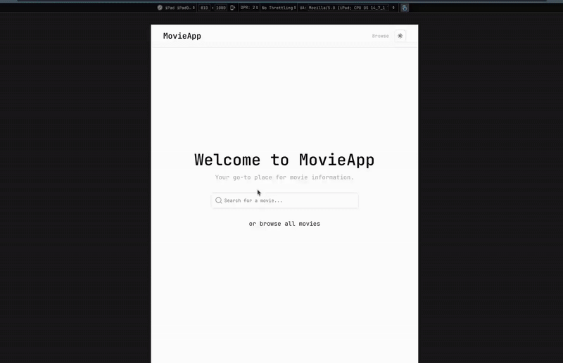

# Minimalist Movie App that you can use


Technologies Used

This project was built using a modern, efficient, and type-safe technology stack:

*   **Framework:** [**React**](https://react.dev/) 
*   **Build Tool:** [**Vite**](https://vitejs.dev/)
*   **Language:** [**TypeScript**](https://www.typescriptlang.org/) 
*   **Styling:** [**Tailwind CSS**](https://tailwindcss.com/) 
*   **Components:** [**Shadcn UI**](https://ui.shadcn.com/) 
*   **Routing:** [**React Router DOM**](https://reactrouter.com/) 
*   **Data Fetching:** [**OMDb API**](http://www.omdbapi.com/)
*   **Icons:** [**Lucide React**](https://lucide.dev/) 

## Optimizations and Best Practices


1.  **Centralized Logic with Custom Hooks:**

2.  **Performance with `useCallback`:**

4.  **Robust Data Handling:**

5.  **Efficient Routing:**

## Getting Started

To get a local copy up and running, follow these simple steps.

### Prerequisites

*   Node.js (v18 or higher recommended)
*   npm (or your package manager of choice)
*   An API key from [OMDb API](http://www.omdbapi.com/apikey.aspx)

### Installation

1.  **Clone the repository:**
    ```sh

    git clone https://github.com/your-username/movie-app.git
    cd movie-app

    ```

2.  **Install NPM packages:**
3. 
    ```sh

    npm install
    ```

3.  **Set up your environment variables:**
    *   Create a file named `.env` in the root of the project.
    *   Add your OMDb API key to it as follows:
    * 
        ```env

        VITE_OMDB_API_KEY=your_api_key_here
        ```

4.  **Run the development server:**
    ```sh

    npm run dev
    ```
    The application should now be running on `http://localhost:5173` (or another port if 5173 is in use). 